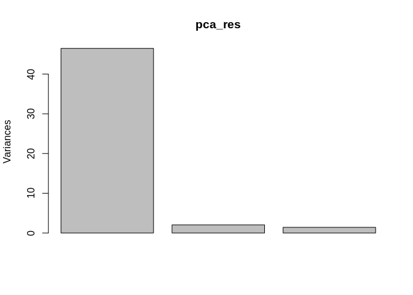
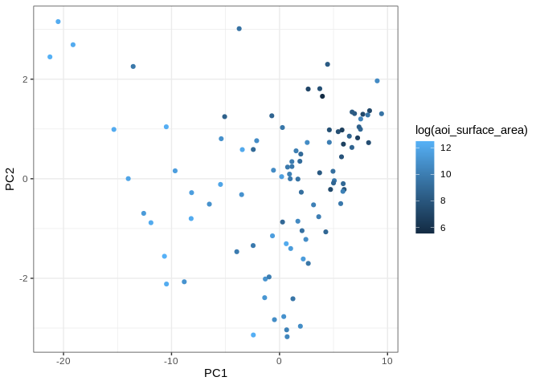
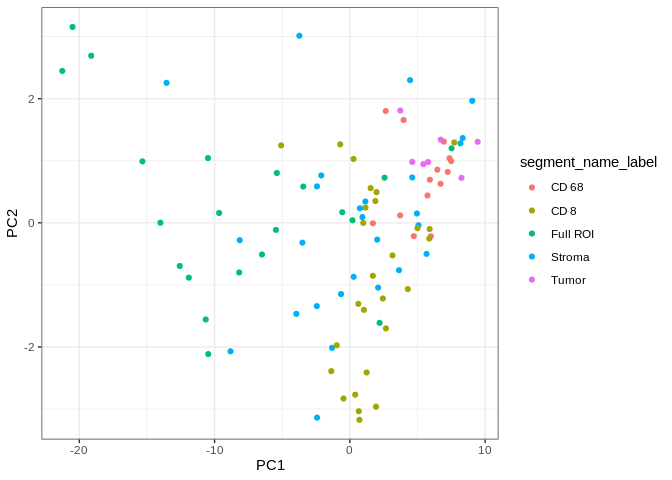
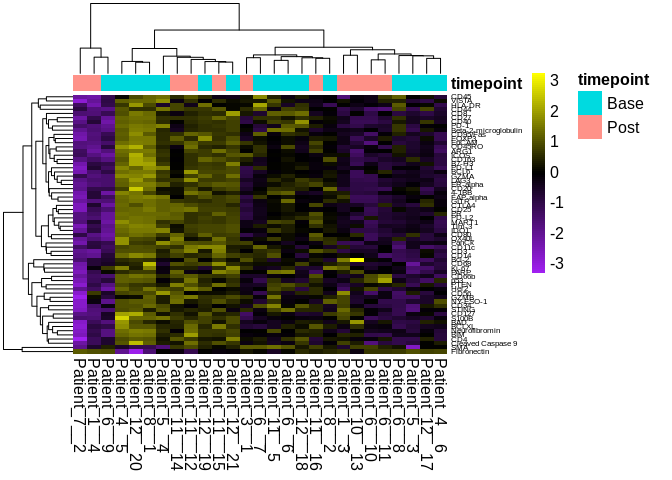
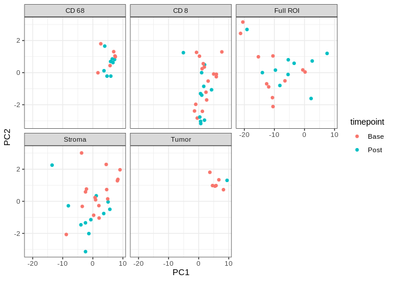
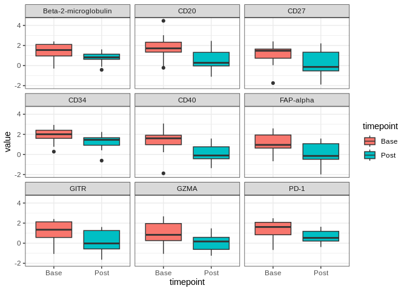
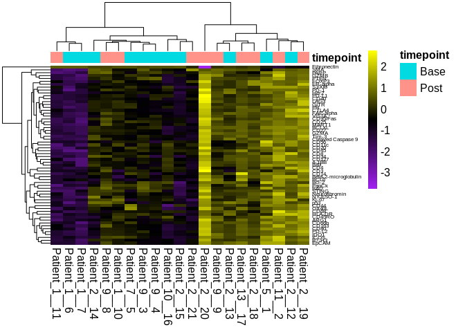
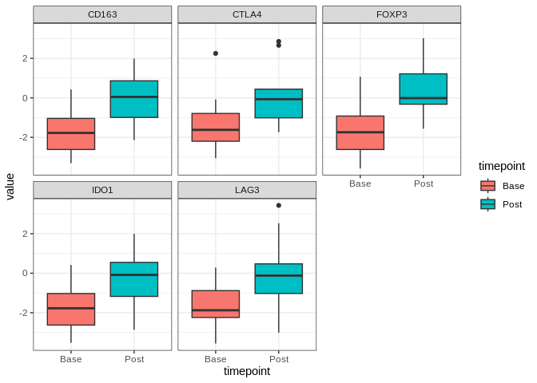

Load packages
-------------

    .libPaths("/ix1/acillo/arc85/packages/Rlibs_sarc028")

    library(tidyverse)

    ## ── Attaching core tidyverse packages ───────────────────────────────────────────── tidyverse 2.0.0 ──
    ## ✔ dplyr     1.1.0     ✔ readr     2.1.4
    ## ✔ forcats   1.0.0     ✔ stringr   1.5.0
    ## ✔ ggplot2   3.4.1     ✔ tibble    3.1.8
    ## ✔ lubridate 1.9.2     ✔ tidyr     1.3.0
    ## ✔ purrr     1.0.1     
    ## ── Conflicts ─────────────────────────────────────────────────────────────── tidyverse_conflicts() ──
    ## ✖ dplyr::filter() masks stats::filter()
    ## ✖ dplyr::lag()    masks stats::lag()
    ## ℹ Use the conflicted package (<http://conflicted.r-lib.org/>) to force all conflicts to become errors

    library(irlba)

    ## Loading required package: Matrix
    ## 
    ## Attaching package: 'Matrix'
    ## 
    ## The following objects are masked from 'package:tidyr':
    ## 
    ##     expand, pack, unpack

    library(ggplot2)
    library(patchwork)
    library(xlsx)
    library(ggplotify)
    library(here)

    ## here() starts at /ix1/acillo/arc85/03_workspace/20_sarc028_ewing/sarc028_ewing

Load data
---------

    ## Read in GeoMx data
    geomx_data <- readRDS("../../01_input/SARC028_GeoMx_Expression_and_Metadata.rds")

    row_data <- geomx_data$geomx_feature_data
    meta_data <- geomx_data$geomx_meta
    expr_data <- geomx_data$geomx_expr

Normalization strategy
----------------------

Rather than directly correcting for AOI surface area, we will attempt to
log normalize the protein counts based on the total counts per ROI,
which should be correlated with the AOI surface area.

    data_expr_fil <- expr_data[!row_data$code_class %in% c("Control","Negative"),]
    rownames(data_expr_fil) <- row_data %>%
      filter(!code_class %in% c("Control","Negative")) %>%
      pull(gene)

    data_expr_fil <- data_expr_fil %>%
      as_tibble(.,rownames="genes")

    log_normalize <- function(x) {
      log(x/sum(x)*1000)
    }

    data_norm <- apply(data_expr_fil[,2:ncol(data_expr_fil)],2,log_normalize)

PCA with log normalized data
----------------------------

    set.seed(123456)

    pca_res <- prcomp_irlba(t(data_norm),center=TRUE,scale.=TRUE)
    plot(pca_res)

    pca_x <- pca_res$x
    pca_x <- cbind(meta_data,pca_x)

    pca_x %>%
      ggplot(.,aes(x=PC1,PC2,colour=log(aoi_surface_area))) +
        geom_point() +
        theme_bw()

    pca_x %>%
      ggplot(.,aes(x=PC1,PC2,colour=segment_name_label)) +
        geom_point() +
        theme_bw()

    p2 <- pca_x %>%
      ggplot(.,aes(x=PC1,PC2,colour=timepoint)) +
        geom_point() +
        facet_wrap(~segment_name_label) +
        theme_bw()

DEGs with specific regions
--------------------------

    data_norm_meta <- rbind(data_norm,t(meta_data)) %>%
      t() %>%
      data.frame() %>%
      as_tibble()

    data_norm_meta %>% 
      data.frame() %>%
      select(segment_name_label,timepoint) %>%
      table()

    ##                   timepoint
    ## segment_name_label Base Post
    ##           CD 68       6    8
    ##           CD 8       16   11
    ##           Full ROI   11   10
    ##           Stroma     16   11
    ##           Tumor       6    1

    colnames(data_norm_meta)[1:62] <- data_expr_fil$genes

    pre_post_degs_segments <- data_norm_meta %>%
      select(-roi_id,-segment,-roi_x_coord,-roi_y_coord,-aoi_surface_area,-aoi_nuclei_count,-slide,-roi,-sample_identifier) %>%
      gather(gene,value,-segment_name_label,-timepoint,-deident_id) %>%
      mutate(value=as.numeric(value)) %>%
      mutate(timepoint=as.factor(timepoint)) %>%
      filter(!segment_name_label=="Tumor") %>% 
      split(.$segment_name_label) %>%
      lapply(.,function(x) {
        x %>%
          split(.$gene) %>%
            map(~wilcox.test(.$value~.$timepoint,data=.)$p.value)
      })
     
    degs_sig <- pre_post_degs_segments %>%
      lapply(.,function(x) {
        x[x<0.05]
      })

Heatmaps for distinct subsets - Stromal region
----------------------------------------------

    stromal_genes <- names(degs_sig$Stroma)
    annot_col <- data_norm_meta %>% 
      filter(segment_name_label=="Stroma") %>%
      select(timepoint) %>%
      data.frame()
    annot_col$timepoint <- as.factor(annot_col$timepoint)

    pid_names <- data_norm_meta %>% 
      filter(segment_name_label=="Stroma") %>%
      select(timepoint,deident_id) %>%
      mutate(pid=paste(deident_id,seq(1,21,1),sep="__")) 

    rownames(annot_col) <- pid_names$pid

    heat_dat <- data_norm_meta %>% 
      filter(segment_name_label=="Stroma") %>%
      select(-timepoint,-segment_name_label) %>%
      select(data_expr_fil$genes) %>%
      as.matrix() %>%
      apply(.,2,as.numeric) %>% 
      scale() %>%
      t()
    colnames(heat_dat) <- pid_names$pid

    p3 <- ggplotify::as.ggplot(
      pheatmap::pheatmap(heat_dat,scale="none",annotation_col = annot_col,fontsize = 12,
                       fontsize_row=6,border_color=NA,color=colorRampPalette(colors=c("purple","black","yellow"))(100))
    )

Heatmaps for distinct subsets - Full ROI
----------------------------------------

    full_roi_genes <- names(degs_sig$`Full ROI`)
    annot_col <- data_norm_meta %>% 
      filter(segment_name_label=="Full ROI") %>%
      select(timepoint) %>%
      data.frame()
    annot_col$timepoint <- as.factor(annot_col$timepoint)

    pid_names <- data_norm_meta %>% 
      filter(segment_name_label=="Full ROI") %>%
      select(timepoint,deident_id) %>%
      mutate(pid=paste(deident_id,seq(1,21,1),sep="__")) 

    rownames(annot_col) <- pid_names$pid

    heat_dat <- data_norm_meta %>% 
      filter(segment_name_label=="Full ROI") %>%
      select(-timepoint,-segment_name_label) %>%
      select(data_expr_fil$genes) %>%
      as.matrix() %>%
      apply(.,2,as.numeric) %>% 
      scale() %>%
      t()
    colnames(heat_dat) <- pid_names$pid

    p4 <- ggplotify::as.ggplot(
      pheatmap::pheatmap(heat_dat,scale="none",annotation_col = annot_col,fontsize = 12,
                       fontsize_row=6,border_color=NA,color=colorRampPalette(colors=c("purple","black","yellow"))(100))
    )

Plots of DEGs in Full ROI and stroma
------------------------------------

    expr_tumor_stroma <- data_norm_meta %>%
      select(-roi_id,-segment,-roi_x_coord,-roi_y_coord,-aoi_surface_area,-aoi_nuclei_count,-slide,-roi) %>%
      gather(gene,value,-segment_name_label,-timepoint,-deident_id) %>%
      mutate(value=as.numeric(value)) %>%
      mutate(timepoint=as.factor(timepoint)) %>%
      filter(segment_name_label %in% c("Full ROI","Stroma")) %>% 
      split(.$segment_name_label)

    ## Warning: There was 1 warning in `mutate()`.
    ## ℹ In argument: `value = as.numeric(value)`.
    ## Caused by warning:
    ## ! NAs introduced by coercion

    degs_sub_list <- degs_sig[3:4]

    deg_plots <- mapply(function(x,y) {
      x %>%
        filter(gene %in% names(y)) %>%
        ggplot(.,aes(x=timepoint,y=value,fill=timepoint)) +
        geom_boxplot() +
        theme_bw() +
        facet_wrap(~gene)
    },
    expr_tumor_stroma,degs_sub_list,SIMPLIFY = F)

Show figure components
----------------------

    p2

    p3

    deg_plots[[2]]

    p4

    deg_plots[[1]] 

Session info
------------

    sessionInfo()

    ## R version 4.2.0 (2022-04-22)
    ## Platform: x86_64-pc-linux-gnu (64-bit)
    ## Running under: Red Hat Enterprise Linux
    ## 
    ## Matrix products: default
    ## BLAS:   /usr/lib64/libblas.so.3.4.2
    ## LAPACK: /usr/lib64/liblapack.so.3.4.2
    ## 
    ## locale:
    ## [1] en_US.UTF-8
    ## 
    ## attached base packages:
    ## [1] stats     graphics  grDevices utils     datasets  methods   base     
    ## 
    ## other attached packages:
    ##  [1] here_1.0.1      ggplotify_0.1.0 xlsx_0.6.5      patchwork_1.1.2
    ##  [5] irlba_2.3.5.1   Matrix_1.5-3    lubridate_1.9.2 forcats_1.0.0  
    ##  [9] stringr_1.5.0   dplyr_1.1.0     purrr_1.0.1     readr_2.1.4    
    ## [13] tidyr_1.3.0     tibble_3.1.8    ggplot2_3.4.1   tidyverse_2.0.0
    ## [17] rmarkdown_2.25 
    ## 
    ## loaded via a namespace (and not attached):
    ##  [1] tidyselect_1.2.0   xfun_0.40          rJava_1.0-6        lattice_0.20-45   
    ##  [5] colorspace_2.0-3   vctrs_0.5.2        generics_0.1.3     htmltools_0.5.6.1 
    ##  [9] yaml_2.3.6         utf8_1.2.2         gridGraphics_0.5-1 rlang_1.1.1       
    ## [13] pillar_1.8.1       glue_1.6.2         withr_2.5.0        RColorBrewer_1.1-3
    ## [17] lifecycle_1.0.3    munsell_0.5.0      gtable_0.3.1       evaluate_0.15     
    ## [21] labeling_0.4.2     knitr_1.39         tzdb_0.3.0         fastmap_1.1.0     
    ## [25] fansi_1.0.3        xlsxjars_0.6.1     highr_0.9          scales_1.3.0      
    ## [29] farver_2.1.1       hms_1.1.2          digest_0.6.30      stringi_1.7.8     
    ## [33] grid_4.2.0         rprojroot_2.0.3    cli_3.6.0          tools_4.2.0       
    ## [37] yulab.utils_0.0.4  magrittr_2.0.3     pkgconfig_2.0.3    pheatmap_1.0.12   
    ## [41] ellipsis_0.3.2     timechange_0.2.0   R6_2.5.1           compiler_4.2.0
