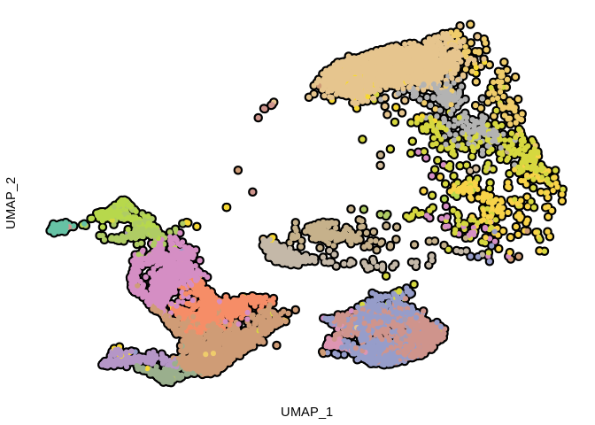
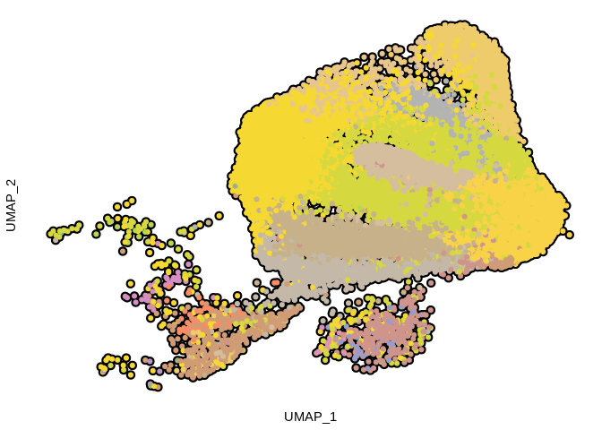
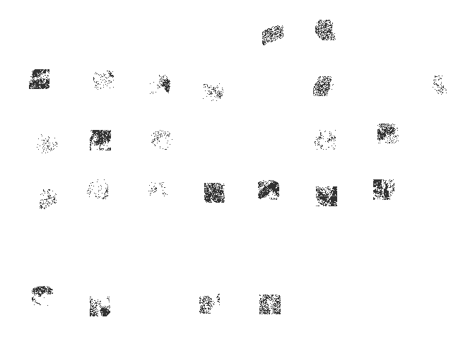
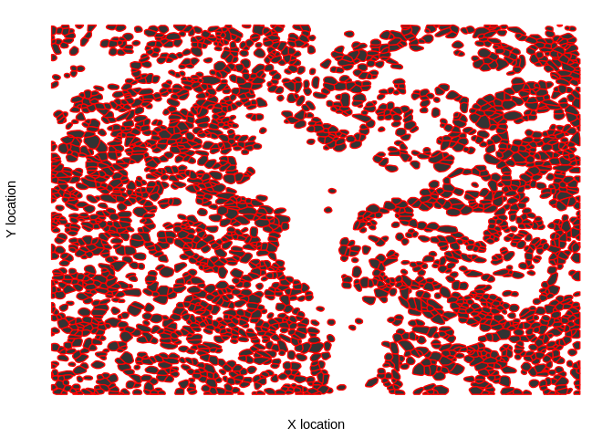
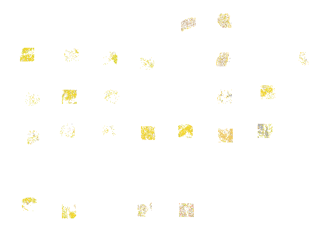
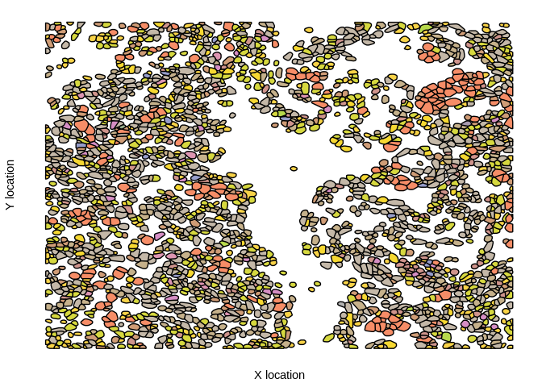

Load packages
-------------

    .libPaths("/ix1/acillo/arc85/packages/Rlibs_sarc028")

    library(tidyverse)

    ## ── Attaching core tidyverse packages ───────────────────────────────────────────── tidyverse 2.0.0 ──
    ## ✔ dplyr     1.1.0     ✔ readr     2.1.4
    ## ✔ forcats   1.0.0     ✔ stringr   1.5.0
    ## ✔ ggplot2   3.4.1     ✔ tibble    3.1.8
    ## ✔ lubridate 1.9.2     ✔ tidyr     1.3.0
    ## ✔ purrr     1.0.1     
    ## ── Conflicts ─────────────────────────────────────────────────────────────── tidyverse_conflicts() ──
    ## ✖ dplyr::filter() masks stats::filter()
    ## ✖ dplyr::lag()    masks stats::lag()
    ## ℹ Use the conflicted package (<http://conflicted.r-lib.org/>) to force all conflicts to become errors

    library(ggplot2)
    library(patchwork)
    library(here)

    ## here() starts at /ix1/acillo/arc85/03_workspace/20_sarc028_ewing/sarc028_ewing

Load data
---------

    umap_meta <- readRDS("../../01_input/SARC028_combined_umap_meta_CosMx_scRNAseq.rds")

    dat_comb_meta <- readRDS("../../01_input/SARC028_CosMx_meta_cell_positions.rds")

Plot scRNAseq/CosMx integrated UMAPs
------------------------------------

    umap_meta$final_cell_annot <- gsub("_"," ",umap_meta$final_cell_annot)
    umap_meta$final_cell_annot <- gsub("pos","\\+",umap_meta$final_cell_annot)
    umap_meta$final_cell_annot <- as.factor(umap_meta$final_cell_annot)

    custom_cols <- colorRampPalette(RColorBrewer::brewer.pal("Set2",n=8))(length(levels(umap_meta$final_cell_annot)))
    cell_names <- levels(umap_meta$final_cell_annot)

    p1 <- umap_meta %>%
      filter(data_type=="scrnaseq") %>% 
      ggplot(.) +
      geom_point(aes(x=UMAP_1,y=UMAP_2),colour="black",size=3) +
      geom_point(aes(x=UMAP_1,y=UMAP_2,colour=final_cell_annot),size=1.5,show.legend = TRUE) +
      scale_color_manual(values=custom_cols,labels=cell_names,drop=FALSE) +
      theme_bw() +
      theme(panel.grid = element_blank(),
            panel.border = element_blank(),
            axis.text = element_blank(),
            axis.ticks = element_blank(),
            legend.position = "none")

    p2 <- umap_meta %>%
      filter(data_type=="nanostring") %>% 
      filter(UMAP_1<6) %>% 
      ggplot(.) +
      geom_point(aes(x=UMAP_1,y=UMAP_2),colour="black",size=3) +
      geom_point(aes(x=UMAP_1,y=UMAP_2,colour=final_cell_annot),size=1.5,show.legend=TRUE) +
      scale_color_manual(values=custom_cols,labels=cell_names,
                         drop=FALSE) +
      theme_bw() +
      theme(panel.grid = element_blank(),
            panel.border = element_blank(),
            axis.text = element_blank(),
            axis.ticks = element_blank(),
            legend.position="none")

    p2x <- umap_meta %>%
      filter(data_type=="scrnaseq") %>% 
      mutate(`Cell types`=final_cell_annot) %>% 
      ggplot(.) +
      geom_point(aes(x=UMAP_1,y=UMAP_2),colour="black",size=3) +
      geom_point(aes(x=UMAP_1,y=UMAP_2,colour=`Cell types`),size=1.5,show.legend = TRUE) +
      scale_color_manual(values=custom_cols,labels=cell_names,drop=FALSE) +
      theme_bw() +
      theme(panel.grid = element_blank(),
            panel.border = element_blank(),
            axis.text = element_blank(),
            axis.ticks = element_blank()) +
      guides(colour=guide_legend(ncol=1))

    legend <- cowplot::get_legend(p2x)
    p2_l <- ggplotify::as.ggplot(legend)

Plot positions of cells from CosMx
----------------------------------

    p3 <- dat_comb_meta %>%
      mutate(group_info=paste(fov,cellID,sep="_")) %>% 
      ggplot(.,aes(x=y_global_px,y=x_global_px,group=group_info)) +
      geom_polygon() +
      theme_bw() +
      theme(panel.grid = element_blank(),
            panel.border = element_blank(),
            axis.text = element_blank(),
            axis.ticks = element_blank(),
            axis.title = element_blank(),
            legend.position="none")

    p4 <- dat_comb_meta %>%
      mutate(group_info=paste(fov,cellID,sep="_")) %>% 
      filter(fov=="1") %>% 
      ggplot(.,aes(x=y_global_px,y=x_global_px,group=group_info)) +
      geom_polygon(colour="red") +
      theme_bw() +
      theme(panel.grid = element_blank(),
            panel.border = element_blank(),
            axis.text = element_blank(),
            axis.ticks = element_blank(),
            legend.position="none") +
      xlab("X location") +
      ylab("Y location")

    p5 <- dat_comb_meta %>%
      mutate(group_info=paste(fov,cellID,sep="_")) %>% 
      ggplot(.) +
      geom_polygon(aes(x=y_global_px,y=x_global_px,group=group_info,fill=final_cell_annot),show.legend=TRUE) +
      scale_fill_manual(values=custom_cols,labels=cell_names,drop=FALSE) +
      theme_minimal() +
      theme(panel.grid = element_blank(),
            axis.text=element_blank(),
            axis.title=element_blank(),
            legend.position="none") +
      xlab("X location") +
      ylab("Y location")

    p6 <- dat_comb_meta %>%
      mutate(final_cell_annot=as.factor(final_cell_annot)) %>% 
      filter(fov==1) %>% 
      filter(!is.na(final_cell_annot)) %>% 
      mutate(group_info=paste(fov,cellID,sep="_")) %>% 
      ggplot(.) +
      geom_polygon(aes(x=y_global_px,y=x_global_px,group=group_info,fill=final_cell_annot),colour="black",show.legend=TRUE) +
      scale_fill_manual(values=custom_cols,labels=cell_names,drop=FALSE) +
      theme_minimal() +
      theme(panel.grid = element_blank(),
            axis.text=element_blank(),
            legend.position="none") +
      xlab("X location") +
      ylab("Y location")

Show figure components
----------------------

    p1

    p2

    p3

    p4

    p5

    p6 

Session info
------------

    sessionInfo()

    ## R version 4.2.0 (2022-04-22)
    ## Platform: x86_64-pc-linux-gnu (64-bit)
    ## Running under: Red Hat Enterprise Linux
    ## 
    ## Matrix products: default
    ## BLAS:   /usr/lib64/libblas.so.3.4.2
    ## LAPACK: /usr/lib64/liblapack.so.3.4.2
    ## 
    ## locale:
    ## [1] en_US.UTF-8
    ## 
    ## attached base packages:
    ## [1] stats     graphics  grDevices utils     datasets  methods   base     
    ## 
    ## other attached packages:
    ##  [1] here_1.0.1      patchwork_1.1.2 lubridate_1.9.2 forcats_1.0.0  
    ##  [5] stringr_1.5.0   dplyr_1.1.0     purrr_1.0.1     readr_2.1.4    
    ##  [9] tidyr_1.3.0     tibble_3.1.8    ggplot2_3.4.1   tidyverse_2.0.0
    ## [13] rmarkdown_2.25 
    ## 
    ## loaded via a namespace (and not attached):
    ##  [1] highr_0.9          RColorBrewer_1.1-3 pillar_1.8.1       compiler_4.2.0    
    ##  [5] yulab.utils_0.0.4  tools_4.2.0        digest_0.6.30      timechange_0.2.0  
    ##  [9] evaluate_0.15      lifecycle_1.0.3    gtable_0.3.1       pkgconfig_2.0.3   
    ## [13] rlang_1.1.1        ggplotify_0.1.0    cli_3.6.0          yaml_2.3.6        
    ## [17] xfun_0.40          fastmap_1.1.0      withr_2.5.0        knitr_1.39        
    ## [21] gridGraphics_0.5-1 generics_0.1.3     vctrs_0.5.2        hms_1.1.2         
    ## [25] cowplot_1.1.1      rprojroot_2.0.3    grid_4.2.0         tidyselect_1.2.0  
    ## [29] glue_1.6.2         R6_2.5.1           fansi_1.0.3        farver_2.1.1      
    ## [33] tzdb_0.3.0         magrittr_2.0.3     scales_1.3.0       htmltools_0.5.6.1 
    ## [37] ellipsis_0.3.2     colorspace_2.0-3   labeling_0.4.2     utf8_1.2.2        
    ## [41] stringi_1.7.8      munsell_0.5.0
