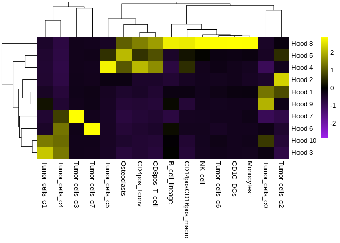
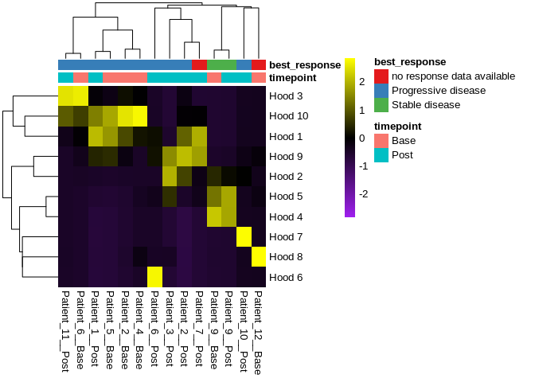
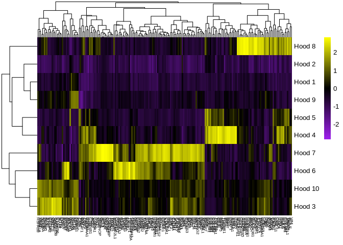
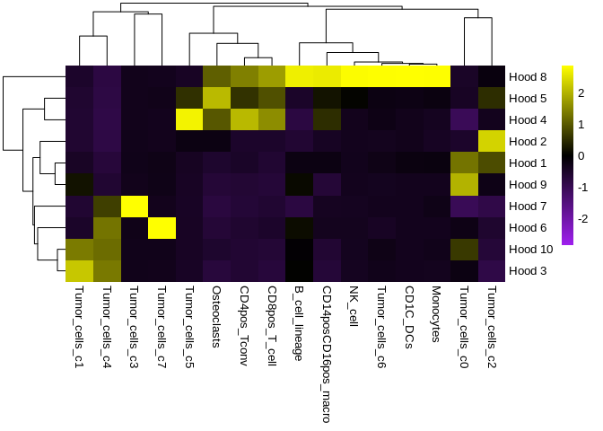
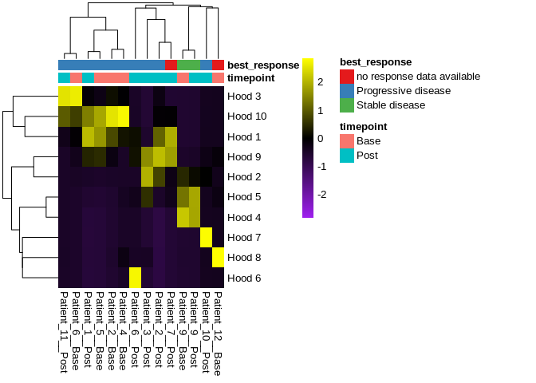
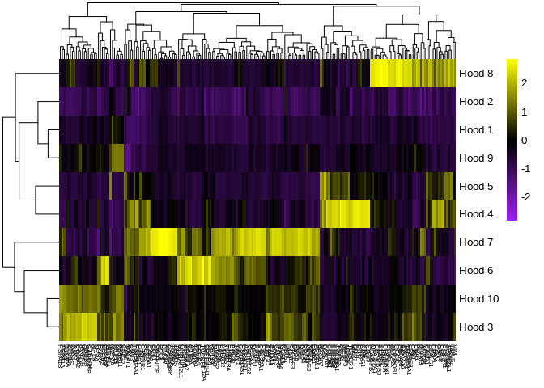

Load packages
-------------

    .libPaths("/ix1/acillo/arc85/packages/Rlibs_sarc028")

    library(tidyverse)
    library(ggplot2)
    library(patchwork)
    library(here)

Load data
---------

    hoods_clust_comb <- readRDS("../../01_input/SARC028_spatial_clustering_results.rds")
    dat_comb_meta <- readRDS("../../01_input/SARC028_CosMx_meta_cell_positions.rds")
    hood_degs <- readRDS("../../01_input/SARC028_CosMx_spatial_hood_DEGs.rds")
    cosmx_expr_meta <- readRDS("../../01_input/SARC028_CosMx_expression_metadata.rds")

Plot heatmap of neighborhoods
-----------------------------

    mean_cell_freq <- hoods_clust_comb %>%
      select(all_of(colnames(hoods_clust_comb)[c(1:19)])) %>% 
      gather(cell_type,freq,-cluster,-fov,-cb) %>%
      group_by(cluster,cell_type) %>%
      summarize(mean_freq=mean(freq)) %>%
      ungroup() %>%
      spread(cell_type,mean_freq) %>%
      data.frame()

    ## `summarise()` has grouped output by 'cluster'. You can override using the
    ## `.groups` argument.

    mean_cell_freq <- mean_cell_freq[,2:ncol(mean_cell_freq)]

    ## Renaming clusters to match original figure
    ## Clustering name is arbitrary from K means, cluster constitutents are the same
    mapping <- data.frame(here_clust=seq(1,10,1),pub_clust=NA)

    mapping[3,"pub_clust"] <- 8
    mapping[9,"pub_clust"] <- 4
    mapping[2,"pub_clust"] <- 5
    mapping[5,"pub_clust"] <- 2
    mapping[1,"pub_clust"] <- 1
    mapping[10,"pub_clust"] <- 9
    mapping[4,"pub_clust"] <- 7
    mapping[7,"pub_clust"] <- 6
    mapping[8,"pub_clust"] <- 3
    mapping[6,"pub_clust"] <- 10

    rownames(mean_cell_freq) <- paste("Hood ",c(mapping$pub_clust),sep="")

    ## Plot heatmap
    p2 <- ggplotify::as.ggplot(pheatmap::pheatmap(mean_cell_freq,scale="column",border_color=NA,color=colorRampPalette(colors = c("purple","black","yellow"))(1000)))

Plot heatmap of neighborhoods and outcomes
------------------------------------------

    meta_to_add <- dat_comb_meta %>%
      select(cb,deident_id,timepoint,best_resp)

    heat_dat <- left_join(hoods_clust_comb,meta_to_add,by="cb") %>%
      select(deident_id,cluster,timepoint) %>%
      mutate(cluster=as.factor(cluster)) %>%
      group_by(deident_id,timepoint) %>%
      mutate(total_cells=n()) %>%
      group_by(deident_id,cluster,timepoint) %>%
      mutate(cluster_counts=n()) %>%
      ungroup() %>%
      mutate(cluster_freq=cluster_counts/total_cells) %>%
      distinct() %>%
      select(deident_id,timepoint,cluster,cluster_freq) %>%
      spread(cluster,cluster_freq) 

    ## Warning in left_join(hoods_clust_comb, meta_to_add, by = "cb"): Each row in `x` is expected to match at most 1 row in `y`.
    ## ℹ Row 1 of `x` matches multiple rows.
    ## ℹ If multiple matches are expected, set `multiple = "all"` to silence this warning.

    heat_dat[is.na(heat_dat)] <- 0

    for_heatmap <- heat_dat[,3:12] %>%
      data.frame()
    rownames(for_heatmap) <- paste(heat_dat$deident_id,heat_dat$timepoint,sep="__")

    ## Renaming clusters to match original figure
    ## Clustering name is arbitrary from K means, cluster constitutents are the same
    mapping <- data.frame(here_clust=seq(1,10,1),pub_clust=NA)

    mapping[8,"pub_clust"] <- 3
    mapping[6,"pub_clust"] <- 10
    mapping[10,"pub_clust"] <- 1
    mapping[1,"pub_clust"] <- 9
    mapping[5,"pub_clust"] <- 2
    mapping[2,"pub_clust"] <- 5
    mapping[9,"pub_clust"] <- 4
    mapping[4,"pub_clust"] <- 7
    mapping[3,"pub_clust"] <- 8
    mapping[7,"pub_clust"] <- 6

    colnames(for_heatmap) <- paste("Hood ",mapping$pub_clust,sep="")

    for_heatmap <- for_heatmap %>%
      t()

    col_annot_raw <- left_join(hoods_clust_comb,meta_to_add,by="cb") %>%
        select(best_resp,timepoint,deident_id) %>%
        distinct() %>%
        data.frame()

    ## Warning in left_join(hoods_clust_comb, meta_to_add, by = "cb"): Each row in `x` is expected to match at most 1 row in `y`.
    ## ℹ Row 1 of `x` matches multiple rows.
    ## ℹ If multiple matches are expected, set `multiple = "all"` to silence this warning.

    col_annot <- data.frame(timepoint=col_annot_raw$timepoint,
                            best_response=col_annot_raw$best_resp)
    rownames(col_annot) <- paste(col_annot_raw$deident_id,col_annot_raw$timepoint,sep="__")

    ## Create colors for two sets of vars
    gg_color_hue <- function(n) {
      hues = seq(15, 375, length = n + 1)
      hcl(h = hues, l = 65, c = 100)[1:n]
    }

    timepoint_colors <- gg_color_hue(2)
    response_colors <- RColorBrewer::brewer.pal(3,"Set1")

    ann_colors <- list(
      timepoint = c(Base=timepoint_colors[1],Post=timepoint_colors[2]),
      best_response = c("no response data available"=response_colors[1],
                        "Progressive disease"=response_colors[2],
                        "Stable disease"=response_colors[3])
    )

    p3 <- ggplotify::as.ggplot(pheatmap::pheatmap(for_heatmap,scale="column",annotation_col=col_annot,annotation_colors = ann_colors,border_color=NA,annotation_legend=T,color=colorRampPalette(colors = c("purple","black","yellow"))(1000)))

Plot DEGs across neighborhoods
------------------------------

    degs_use <- hood_degs %>%                                                                          
      filter(p_val_adj<0.05) %>%                                                                             
      filter(avg_log2FC>0) %>%                                                                               
      select(gene) %>%                                                                                    
      distinct() %>%                                                                                    
      pull()

    heat_dat <- cosmx_expr_meta %>%
      filter(!is.na(spatial_clusters)) %>%
      select(spatial_clusters,all_of(degs_use)) %>%
      gather(genes,values,-spatial_clusters) %>%
      group_by(spatial_clusters,genes) %>%
      summarize(mean_expr=mean(values)) %>%
      ungroup() %>%
      spread(genes,mean_expr) %>%
      data.frame()

    ## `summarise()` has grouped output by 'spatial_clusters'. You can override using the `.groups`
    ## argument.

    heat_dat_plot <- heat_dat[,2:ncol(heat_dat)]

    ## Renaming cluster to match with original
    ## Clustering name is arbitrary from K means, cluster constitutents are the same

    mapping <- data.frame(here_clust=seq(1,10,1),pub_clust=NA)
    mapping[1,"pub_clust"] <- 1
    mapping[2,"pub_clust"] <- 5
    mapping[3,"pub_clust"] <- 8
    mapping[9,"pub_clust"] <- 4
    mapping[5,"pub_clust"] <- 2
    mapping[7,"pub_clust"] <- 6
    mapping[4,"pub_clust"] <- 7
    mapping[8,"pub_clust"] <- 3
    mapping[10,"pub_clust"] <- 9
    mapping[6,"pub_clust"] <- 10

    rownames(heat_dat_plot) <- paste("Hood ",mapping$pub_clust,sep="")

    p4 <- ggplotify::as.ggplot(pheatmap::pheatmap(heat_dat_plot,scale="column",fontsize_col=6,border_color=NA,color=colorRampPalette(colors = c("purple","black","yellow"))(1000)))

Show figure components
----------------------

    p2

    p3

    p4

Session info
------------

    sessionInfo()

    ## R version 4.2.0 (2022-04-22)
    ## Platform: x86_64-pc-linux-gnu (64-bit)
    ## Running under: Red Hat Enterprise Linux
    ## 
    ## Matrix products: default
    ## BLAS:   /usr/lib64/libblas.so.3.4.2
    ## LAPACK: /usr/lib64/liblapack.so.3.4.2
    ## 
    ## locale:
    ## [1] en_US.UTF-8
    ## 
    ## attached base packages:
    ## [1] stats     graphics  grDevices utils     datasets  methods   base     
    ## 
    ## other attached packages:
    ##  [1] here_1.0.1      patchwork_1.1.2 lubridate_1.9.2 forcats_1.0.0  
    ##  [5] stringr_1.5.0   dplyr_1.1.0     purrr_1.0.1     readr_2.1.4    
    ##  [9] tidyr_1.3.0     tibble_3.1.8    ggplot2_3.4.1   tidyverse_2.0.0
    ## [13] rmarkdown_2.25 
    ## 
    ## loaded via a namespace (and not attached):
    ##  [1] highr_0.9          RColorBrewer_1.1-3 pillar_1.8.1       compiler_4.2.0    
    ##  [5] yulab.utils_0.0.4  tools_4.2.0        digest_0.6.30      timechange_0.2.0  
    ##  [9] evaluate_0.15      lifecycle_1.0.3    gtable_0.3.1       pkgconfig_2.0.3   
    ## [13] rlang_1.1.1        ggplotify_0.1.0    cli_3.6.0          yaml_2.3.6        
    ## [17] xfun_0.40          fastmap_1.1.0      withr_2.5.0        knitr_1.39        
    ## [21] gridGraphics_0.5-1 generics_0.1.3     vctrs_0.5.2        hms_1.1.2         
    ## [25] cowplot_1.1.1      rprojroot_2.0.3    grid_4.2.0         tidyselect_1.2.0  
    ## [29] glue_1.6.2         R6_2.5.1           fansi_1.0.3        pheatmap_1.0.12   
    ## [33] farver_2.1.1       tzdb_0.3.0         magrittr_2.0.3     scales_1.3.0      
    ## [37] htmltools_0.5.6.1  ellipsis_0.3.2     colorspace_2.0-3   labeling_0.4.2    
    ## [41] utf8_1.2.2         stringi_1.7.8      munsell_0.5.0
