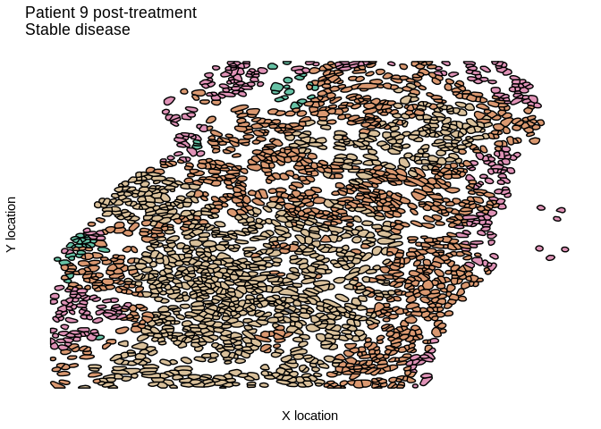
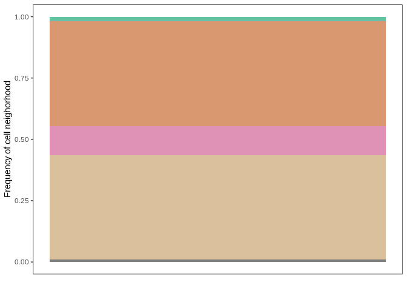
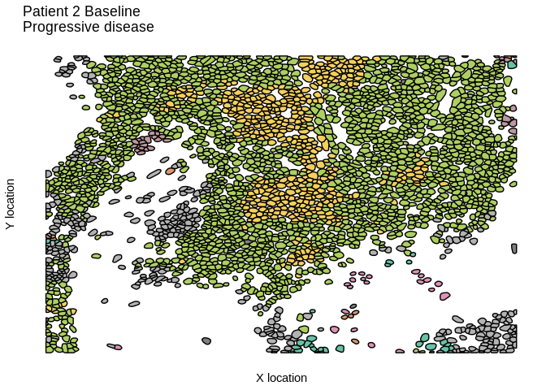
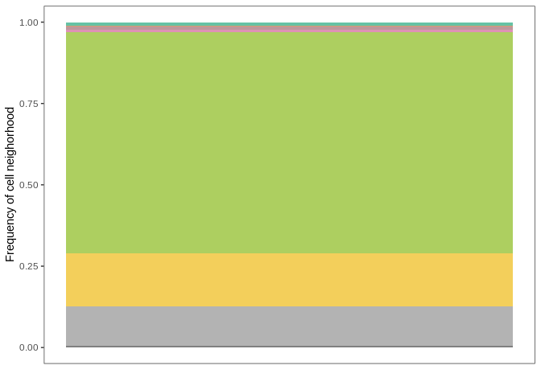
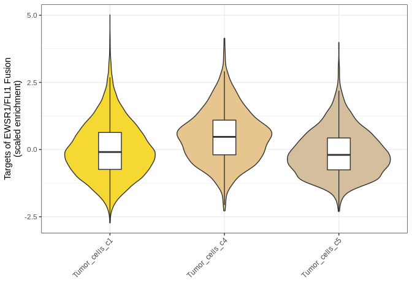
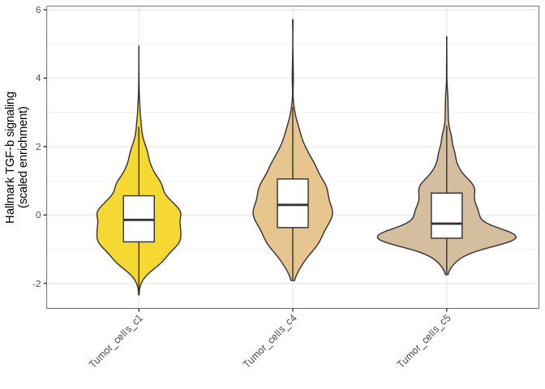
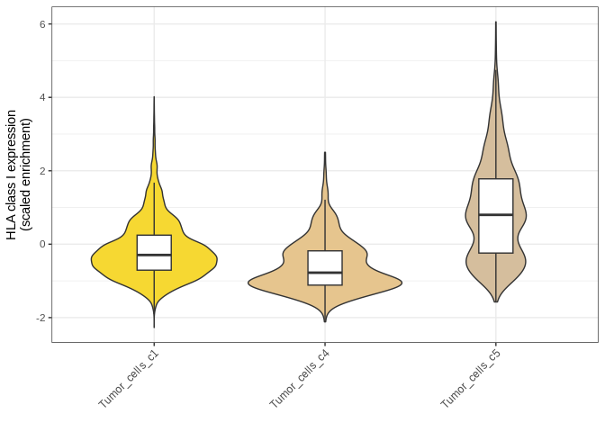
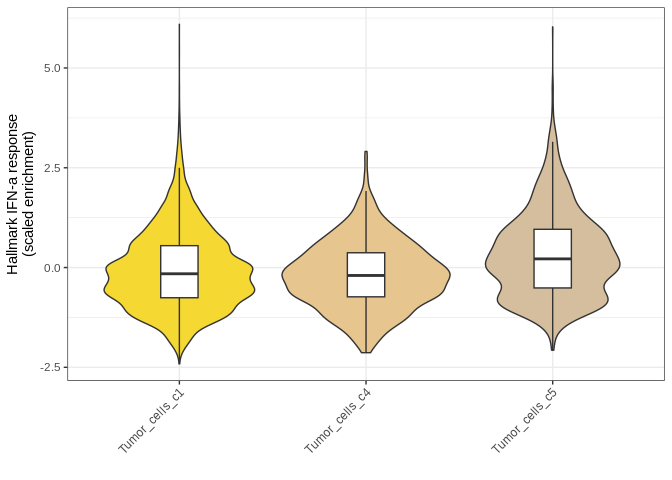
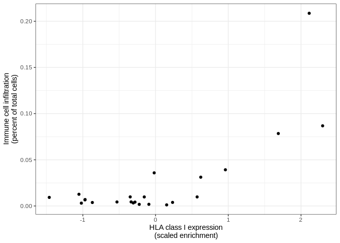
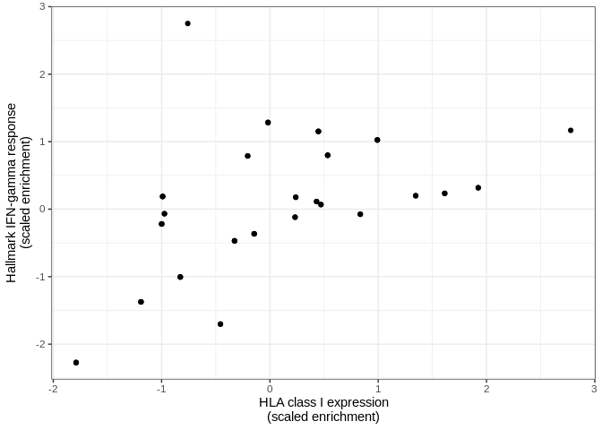

Load packages
-------------

    .libPaths("/ix1/acillo/arc85/packages/Rlibs_sarc028")

    library(tidyverse)
    library(ggplot2)
    library(patchwork)
    library(here)

Load data
---------

    cosmx_gene_sets <- readRDS("../../01_input/SARC028_CosMx_gene_sets_results.rds")
    dat_comb_meta <- readRDS("../../01_input/SARC028_CosMx_meta_cell_positions.rds")

    cosmx_spatial_clusters <- cosmx_gene_sets %>%
      select(cb,spatial_clusters)

    dat_comb_meta <- left_join(dat_comb_meta,cosmx_spatial_clusters,by="cb")
    dat_comb_meta$spatial_clusters <- as.factor(dat_comb_meta$spatial_clusters)

Cell location neighborhood plots for responder and non-responder
----------------------------------------------------------------

    custom_cols <- colorRampPalette(RColorBrewer::brewer.pal("Set2",n=8))(10)
    cluster_names <- levels(dat_comb_meta$spatial_clusters)
    names(custom_cols) <- cluster_names

    p1 <- dat_comb_meta  %>%
      mutate(group_info=paste(fov_selected,cb,sep="_")) %>% 
      filter(fov_selected=="20") %>% 
      ggplot(.,aes(x=y_global_px,y=x_global_px,group=group_info,fill=spatial_clusters)) +
      geom_polygon(colour="black") +
      scale_fill_manual(values=custom_cols) +
      theme_bw() +
      theme(panel.grid = element_blank(),
            panel.border = element_blank(),
            axis.text = element_blank(),
            axis.ticks = element_blank(),
            legend.position="none") +
      xlab("X location") +
      ylab("Y location") +
      ggtitle("Patient 9 post-treatment\nStable disease")

    p2 <- dat_comb_meta  %>%
      mutate(group_info=paste(fov,cellID,sep="_")) %>% 
      filter(fov=="20") %>% 
      select(spatial_clusters) %>%
      mutate(total_cells=n()) %>%
      group_by(spatial_clusters) %>%
      mutate(hood_counts=n()) %>%
      ungroup() %>%
      mutate(hood_freq=hood_counts/total_cells) %>%
      distinct() %>%
      ggplot(.,aes(x=1,y=hood_freq,fill=spatial_clusters)) +
      geom_col() +
      scale_fill_manual(values=custom_cols) +
      theme_bw() +
      theme(panel.grid = element_blank(),
            axis.text.x = element_blank(),
            axis.ticks.x = element_blank(),
            legend.position="none") +
      xlab("") +
      ylab("Frequency of cell neighorhood")

    p3 <- dat_comb_meta  %>%
      mutate(group_info=paste(fov,cellID,sep="_")) %>% 
      filter(fov=="17") %>% 
      ggplot(.,aes(x=y_global_px,y=x_global_px,group=group_info,fill=spatial_clusters)) +
      geom_polygon(colour="black") +
      scale_fill_manual(values=custom_cols) +
      theme_bw() +
      theme(panel.grid = element_blank(),
            panel.border = element_blank(),
            axis.text = element_blank(),
            axis.ticks = element_blank(),
            legend.position="none") +
      xlab("X location") +
      ylab("Y location") +
      ggtitle("Patient 2 Baseline\nProgressive disease")

    p4 <- dat_comb_meta  %>%
      mutate(group_info=paste(fov,cellID,sep="_")) %>% 
      filter(fov=="17") %>% 
      select(spatial_clusters) %>%
      mutate(total_cells=n()) %>%
      group_by(spatial_clusters) %>%
      mutate(hood_counts=n()) %>%
      ungroup() %>%
      mutate(hood_freq=hood_counts/total_cells) %>%
      distinct() %>%
      ggplot(.,aes(x=1,y=hood_freq,fill=spatial_clusters)) +
      geom_col() +
      scale_fill_manual(values=custom_cols) +
      theme_bw() +
      theme(panel.grid = element_blank(),
            axis.text.x = element_blank(),
            axis.ticks.x = element_blank(),
            legend.position="none") +
      xlab("") +
      ylab("Frequency of cell neighorhood")

Plotting gene set scores
------------------------

    ## Plotting
    cosmx_gene_sets $final_cell_annot <- as.factor(cosmx_gene_sets $final_cell_annot)

    custom_cols2 <- colorRampPalette(RColorBrewer::brewer.pal("Set2",n=8))(length(levels(cosmx_gene_sets $final_cell_annot)))
    cell_names <- levels(cosmx_gene_sets $final_cell_annot)
    names(custom_cols2) <- cell_names

    p5 <- cosmx_gene_sets %>%
      filter(final_cell_annot %in% c("Tumor_cells_c5","Tumor_cells_c4","Tumor_cells_c1")) %>%
      ggplot(.,aes(x=final_cell_annot,y=scale(KINSEY_TARGETS_OF_EWSR1_FLII_FUSION_UP))) +
      geom_violin(aes(fill=final_cell_annot)) +
      geom_boxplot(width=0.2,outlier.shape=NA) +
      scale_fill_manual(values=custom_cols2) +
      theme_bw() + 
      theme(axis.text.x=element_text(angle=45,hjust=T),
            legend.position="none") +
      xlab("") +
      ylab("Targets of EWSR1/FLI1 Fusion\n(scaled enrichment)")

    p6 <- cosmx_gene_sets %>%
      filter(final_cell_annot %in% c("Tumor_cells_c5","Tumor_cells_c4","Tumor_cells_c1")) %>%
      ggplot(.,aes(x=final_cell_annot,y=scale(HALLMARK_TGF_BETA_SIGNALING))) +
      geom_violin(aes(fill=final_cell_annot)) +
      geom_boxplot(width=0.2,outlier.shape=NA) +
      scale_fill_manual(values=custom_cols2) +
      theme_bw() + 
      theme(axis.text.x=element_text(angle=45,hjust=T),
            legend.position="none") +
      xlab("") +
      ylab("Hallmark TGF-b signaling\n(scaled enrichment)")

    p7 <- cosmx_gene_sets %>%
      filter(final_cell_annot %in% c("Tumor_cells_c5","Tumor_cells_c4","Tumor_cells_c1")) %>%
      ggplot(.,aes(x=final_cell_annot,y=scale(HLA_signature))) +
      geom_violin(aes(fill=final_cell_annot)) +
      geom_boxplot(width=0.2,outlier.shape=NA) +
      scale_fill_manual(values=custom_cols2) +
      theme_bw() + 
      theme(axis.text.x=element_text(angle=45,hjust=T),
            legend.position="none") +
      xlab("") +
      ylab("HLA class I expression\n(scaled enrichment)")

    p8 <- cosmx_gene_sets %>%
      filter(final_cell_annot %in% c("Tumor_cells_c5","Tumor_cells_c4","Tumor_cells_c1")) %>%
      ggplot(.,aes(x=final_cell_annot,y=scale(HALLMARK_INTERFERON_ALPHA_RESPONSE))) +
      geom_violin(aes(fill=final_cell_annot)) +
      geom_boxplot(width=0.2,outlier.shape=NA) +
      scale_fill_manual(values=custom_cols2) +
      theme_bw() + 
      theme(axis.text.x=element_text(angle=45,hjust=T),
            legend.position="none") +
      xlab("") +
      ylab("Hallmark IFN-a response\n(scaled enrichment)")

Overall immune infiltrate by hoods
----------------------------------

    p9 <- cosmx_gene_sets %>%
      select(fov_selected,HLA_signature,final_cell_annot) %>%
      group_by(fov_selected) %>%
      mutate(total_cells=n()) %>%
      mutate(hla_mean=mean(HLA_signature)) %>%
      select(-HLA_signature) %>%
      ungroup() %>%
      mutate(immune_cell=ifelse(!grepl("Tumor|Osteoclasts",final_cell_annot),"Immune","Non-immune")) %>%
      filter(immune_cell=="Immune") %>%
      group_by(fov_selected) %>%
      mutate(immune_counts=n()) %>%
      ungroup() %>%
      mutate(immune_freq=immune_counts/total_cells) %>%
      select(fov_selected,hla_mean,immune_freq) %>%
      distinct() %>%
      ggplot(.,aes(x=scale(hla_mean),y=immune_freq)) +
      geom_point() +
      theme_bw() +
      xlab("HLA class I expression\n(scaled enrichment)") +
      ylab("Immune cell infiltration\n(percent of total cells)")

    infil_stats <- cosmx_gene_sets %>%
      select(fov_selected,HLA_signature,final_cell_annot) %>%
      group_by(fov_selected) %>%
      mutate(total_cells=n()) %>%
      mutate(hla_mean=mean(HLA_signature)) %>%
      select(-HLA_signature) %>%
      ungroup() %>%
      mutate(immune_cell=ifelse(!grepl("Tumor|Osteoclasts",final_cell_annot),"Immune","Non-immune")) %>%
      filter(immune_cell=="Immune") %>%
      group_by(fov_selected) %>%
      mutate(immune_counts=n()) %>%
      ungroup() %>%
      mutate(immune_freq=immune_counts/total_cells) %>%
      select(fov_selected,hla_mean,immune_freq) %>%
      distinct()

    cor.test(infil_stats$hla_mean,infil_stats$immune_freq,method="spearman")

    ## 
    ##  Spearman's rank correlation rho
    ## 
    ## data:  infil_stats$hla_mean and infil_stats$immune_freq
    ## S = 1146, p-value = 0.03985
    ## alternative hypothesis: true rho is not equal to 0
    ## sample estimates:
    ##       rho 
    ## 0.4337945

    p10 <- cosmx_gene_sets %>%
      filter(final_cell_annot %in% c("Tumor_cells_c5","Tumor_cells_c4","Tumor_cells_c1")) %>%
      select(fov_selected,HALLMARK_INTERFERON_GAMMA_RESPONSE,HLA_signature,final_cell_annot) %>%
      group_by(fov_selected) %>%
      mutate(ifna_mean=mean(HALLMARK_INTERFERON_GAMMA_RESPONSE)) %>%
      select(-HALLMARK_INTERFERON_GAMMA_RESPONSE) %>%
      mutate(hla_mean=mean(HLA_signature)) %>%
      select(-HLA_signature) %>%
      distinct() %>%
      ggplot(.,aes(x=scale(hla_mean),y=scale(ifna_mean))) +
      geom_point() +
      theme_bw() +
      xlab("HLA class I expression\n(scaled enrichment)") +
      ylab("Hallmark IFN-gamma response\n(scaled enrichment)")

    ifn_hla_stats <- cosmx_gene_sets %>%
      filter(final_cell_annot %in% c("Tumor_cells_c5","Tumor_cells_c4","Tumor_cells_c1")) %>%
      select(fov_selected,HALLMARK_INTERFERON_GAMMA_RESPONSE,HLA_signature,final_cell_annot) %>%
      group_by(fov_selected) %>%
      mutate(ifng_mean=mean(HALLMARK_INTERFERON_GAMMA_RESPONSE)) %>%
      select(-HALLMARK_INTERFERON_GAMMA_RESPONSE) %>%
      mutate(hla_mean=mean(HLA_signature)) %>%
      select(-HLA_signature) %>%
      distinct()

    cor.test(ifn_hla_stats$hla_mean,ifn_hla_stats$ifng_mean,method="spearman")

    ## Warning in cor.test.default(ifn_hla_stats$hla_mean, ifn_hla_stats$ifng_mean, :
    ## Cannot compute exact p-value with ties

    ## 
    ##  Spearman's rank correlation rho
    ## 
    ## data:  ifn_hla_stats$hla_mean and ifn_hla_stats$ifng_mean
    ## S = 11090, p-value = 8.015e-08
    ## alternative hypothesis: true rho is not equal to 0
    ## sample estimates:
    ##       rho 
    ## 0.6405961

Statistics
----------

    cosmx_gene_sets %>%
      filter(final_cell_annot %in% c("Tumor_cells_c5","Tumor_cells_c4","Tumor_cells_c1")) %>%
      select(final_cell_annot,KINSEY_TARGETS_OF_EWSR1_FLII_FUSION_UP,HALLMARK_TGF_BETA_SIGNALING,HLA_signature,HALLMARK_INTERFERON_ALPHA_RESPONSE) %>%
      distinct() %>%
      gather(gene_set,values,-final_cell_annot) %>% 
      split(.$gene_set) %>%
      map(~lm(values~final_cell_annot,data=.)) %>%
      map(~summary(.))

    ## $HALLMARK_INTERFERON_ALPHA_RESPONSE
    ## 
    ## Call:
    ## lm(formula = values ~ final_cell_annot, data = .)
    ## 
    ## Residuals:
    ##      Min       1Q   Median       3Q      Max 
    ## -0.11807 -0.03472 -0.00466  0.02988  0.30310 
    ## 
    ## Coefficients:
    ##                                  Estimate Std. Error t value Pr(>|t|)    
    ## (Intercept)                    -0.0112805  0.0004292 -26.285  < 2e-16 ***
    ## final_cell_annotTumor_cells_c4 -0.0061647  0.0016857  -3.657 0.000256 ***
    ## final_cell_annotTumor_cells_c5  0.0188548  0.0010166  18.546  < 2e-16 ***
    ## ---
    ## Signif. codes:  0 '***' 0.001 '**' 0.01 '*' 0.05 '.' 0.1 ' ' 1
    ## 
    ## Residual standard error: 0.04871 on 16569 degrees of freedom
    ## Multiple R-squared:  0.0222, Adjusted R-squared:  0.02209 
    ## F-statistic: 188.1 on 2 and 16569 DF,  p-value: < 2.2e-16
    ## 
    ## 
    ## $HALLMARK_TGF_BETA_SIGNALING
    ## 
    ## Call:
    ## lm(formula = values ~ final_cell_annot, data = .)
    ## 
    ## Residuals:
    ##       Min        1Q    Median        3Q       Max 
    ## -0.127704 -0.040471 -0.006974  0.033614  0.294287 
    ## 
    ## Coefficients:
    ##                                 Estimate Std. Error t value Pr(>|t|)    
    ## (Intercept)                    0.0035169  0.0004853   7.247 4.44e-13 ***
    ## final_cell_annotTumor_cells_c4 0.0236128  0.0019061  12.388  < 2e-16 ***
    ## final_cell_annotTumor_cells_c5 0.0036642  0.0011496   3.188  0.00144 ** 
    ## ---
    ## Signif. codes:  0 '***' 0.001 '**' 0.01 '*' 0.05 '.' 0.1 ' ' 1
    ## 
    ## Residual standard error: 0.05508 on 16569 degrees of freedom
    ## Multiple R-squared:  0.009383,   Adjusted R-squared:  0.009264 
    ## F-statistic: 78.47 on 2 and 16569 DF,  p-value: < 2.2e-16
    ## 
    ## 
    ## $HLA_signature
    ## 
    ## Call:
    ## lm(formula = values ~ final_cell_annot, data = .)
    ## 
    ## Residuals:
    ##      Min       1Q   Median       3Q      Max 
    ## -0.63624 -0.15012 -0.03468  0.11988  1.30549 
    ## 
    ## Coefficients:
    ##                                 Estimate Std. Error t value Pr(>|t|)    
    ## (Intercept)                    -0.215013   0.002025 -106.17   <2e-16 ***
    ## final_cell_annotTumor_cells_c4 -0.112197   0.007955  -14.11   <2e-16 ***
    ## final_cell_annotTumor_cells_c5  0.276393   0.004797   57.62   <2e-16 ***
    ## ---
    ## Signif. codes:  0 '***' 0.001 '**' 0.01 '*' 0.05 '.' 0.1 ' ' 1
    ## 
    ## Residual standard error: 0.2299 on 16569 degrees of freedom
    ## Multiple R-squared:  0.184,  Adjusted R-squared:  0.1839 
    ## F-statistic:  1868 on 2 and 16569 DF,  p-value: < 2.2e-16
    ## 
    ## 
    ## $KINSEY_TARGETS_OF_EWSR1_FLII_FUSION_UP
    ## 
    ## Call:
    ## lm(formula = values ~ final_cell_annot, data = .)
    ## 
    ## Residuals:
    ##       Min        1Q    Median        3Q       Max 
    ## -0.101083 -0.025964 -0.002865  0.022742  0.182851 
    ## 
    ## Coefficients:
    ##                                  Estimate Std. Error t value Pr(>|t|)    
    ## (Intercept)                     0.0084076  0.0003182  26.425  < 2e-16 ***
    ## final_cell_annotTumor_cells_c4  0.0184204  0.0012498  14.739  < 2e-16 ***
    ## final_cell_annotTumor_cells_c5 -0.0038763  0.0007537  -5.143 2.74e-07 ***
    ## ---
    ## Signif. codes:  0 '***' 0.001 '**' 0.01 '*' 0.05 '.' 0.1 ' ' 1
    ## 
    ## Residual standard error: 0.03612 on 16569 degrees of freedom
    ## Multiple R-squared:  0.01563,    Adjusted R-squared:  0.01551 
    ## F-statistic: 131.5 on 2 and 16569 DF,  p-value: < 2.2e-16

    cosmx_gene_sets %>%
      filter(final_cell_annot %in% c("Tumor_cells_c5","Tumor_cells_c4","Tumor_cells_c1")) %>%
      select(final_cell_annot,KINSEY_TARGETS_OF_EWSR1_FLII_FUSION_UP,HALLMARK_TGF_BETA_SIGNALING,HLA_signature,HALLMARK_INTERFERON_ALPHA_RESPONSE) %>%
      distinct() %>%
      gather(gene_set,values,-final_cell_annot) %>% 
      split(.$gene_set) %>%
      map(~pairwise.wilcox.test(.$values,.$final_cell_annot,data=.))

    ## $HALLMARK_INTERFERON_ALPHA_RESPONSE
    ## 
    ##  Pairwise comparisons using Wilcoxon rank sum test with continuity correction 
    ## 
    ## data:  .$values and .$final_cell_annot 
    ## 
    ##                Tumor_cells_c1 Tumor_cells_c4
    ## Tumor_cells_c4 0.01           -             
    ## Tumor_cells_c5 <2e-16         <2e-16        
    ## 
    ## P value adjustment method: holm 
    ## 
    ## $HALLMARK_TGF_BETA_SIGNALING
    ## 
    ##  Pairwise comparisons using Wilcoxon rank sum test with continuity correction 
    ## 
    ## data:  .$values and .$final_cell_annot 
    ## 
    ##                Tumor_cells_c1 Tumor_cells_c4
    ## Tumor_cells_c4 <2e-16         -             
    ## Tumor_cells_c5 0.019          <2e-16        
    ## 
    ## P value adjustment method: holm 
    ## 
    ## $HLA_signature
    ## 
    ##  Pairwise comparisons using Wilcoxon rank sum test with continuity correction 
    ## 
    ## data:  .$values and .$final_cell_annot 
    ## 
    ##                Tumor_cells_c1 Tumor_cells_c4
    ## Tumor_cells_c4 <2e-16         -             
    ## Tumor_cells_c5 <2e-16         <2e-16        
    ## 
    ## P value adjustment method: holm 
    ## 
    ## $KINSEY_TARGETS_OF_EWSR1_FLII_FUSION_UP
    ## 
    ##  Pairwise comparisons using Wilcoxon rank sum test with continuity correction 
    ## 
    ## data:  .$values and .$final_cell_annot 
    ## 
    ##                Tumor_cells_c1 Tumor_cells_c4
    ## Tumor_cells_c4 < 2e-16        -             
    ## Tumor_cells_c5 2.1e-06        < 2e-16       
    ## 
    ## P value adjustment method: holm

Show figure components
----------------------

    p1

    p2

    p3

    p4

    p5

    p6

    p7

    p8

    p9

    p10

Session info
------------

    sessionInfo()

    ## R version 4.2.0 (2022-04-22)
    ## Platform: x86_64-pc-linux-gnu (64-bit)
    ## Running under: Red Hat Enterprise Linux
    ## 
    ## Matrix products: default
    ## BLAS:   /usr/lib64/libblas.so.3.4.2
    ## LAPACK: /usr/lib64/liblapack.so.3.4.2
    ## 
    ## locale:
    ## [1] en_US.UTF-8
    ## 
    ## attached base packages:
    ## [1] stats     graphics  grDevices utils     datasets  methods   base     
    ## 
    ## other attached packages:
    ##  [1] here_1.0.1      patchwork_1.1.2 lubridate_1.9.2 forcats_1.0.0  
    ##  [5] stringr_1.5.0   dplyr_1.1.0     purrr_1.0.1     readr_2.1.4    
    ##  [9] tidyr_1.3.0     tibble_3.1.8    ggplot2_3.4.1   tidyverse_2.0.0
    ## [13] rmarkdown_2.25 
    ## 
    ## loaded via a namespace (and not attached):
    ##  [1] highr_0.9          RColorBrewer_1.1-3 pillar_1.8.1       compiler_4.2.0    
    ##  [5] yulab.utils_0.0.4  tools_4.2.0        digest_0.6.30      timechange_0.2.0  
    ##  [9] evaluate_0.15      lifecycle_1.0.3    gtable_0.3.1       pkgconfig_2.0.3   
    ## [13] rlang_1.1.1        ggplotify_0.1.0    cli_3.6.0          yaml_2.3.6        
    ## [17] xfun_0.40          fastmap_1.1.0      withr_2.5.0        knitr_1.39        
    ## [21] gridGraphics_0.5-1 generics_0.1.3     vctrs_0.5.2        hms_1.1.2         
    ## [25] cowplot_1.1.1      rprojroot_2.0.3    grid_4.2.0         tidyselect_1.2.0  
    ## [29] glue_1.6.2         R6_2.5.1           fansi_1.0.3        pheatmap_1.0.12   
    ## [33] farver_2.1.1       tzdb_0.3.0         magrittr_2.0.3     scales_1.3.0      
    ## [37] htmltools_0.5.6.1  ellipsis_0.3.2     colorspace_2.0-3   labeling_0.4.2    
    ## [41] utf8_1.2.2         stringi_1.7.8      munsell_0.5.0
